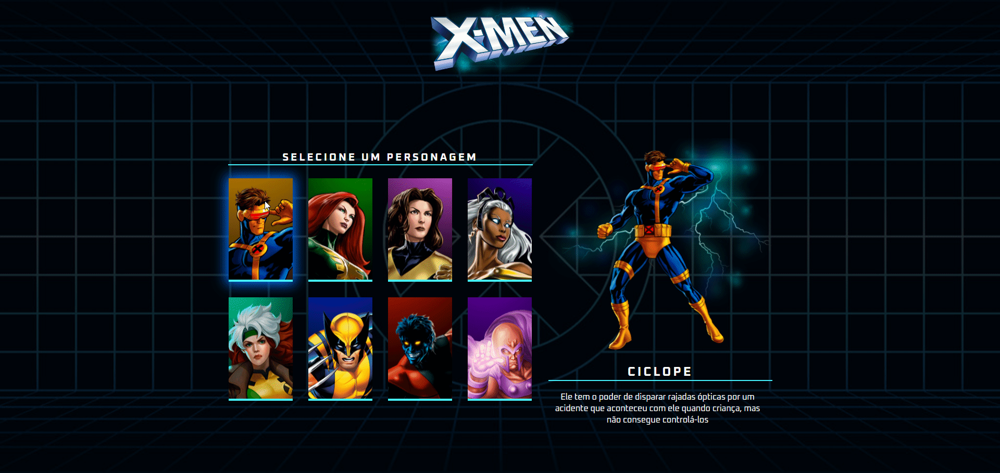

 

# Sobre o projeto

Projeto de uma tela de seleção de personagens dos X-Mens na 9ª edição da **SEMANA DO ZERO AO PROGRAMADOR CONTRATADO**, evento organizado pela [DevEmDobro](https://devemdobro.com/ "Site do DevEmDobro").

O projeto consiste em simular uma tela de seleção de personagem dos X-Mens.

## Layout web

# Tecnologias utilizadas
## Front end
- HTML
- CSS
- JavaScript

# Autor

Thiago Leoni Amaral aka Heroleam

https://heroleam.github.io/herofield